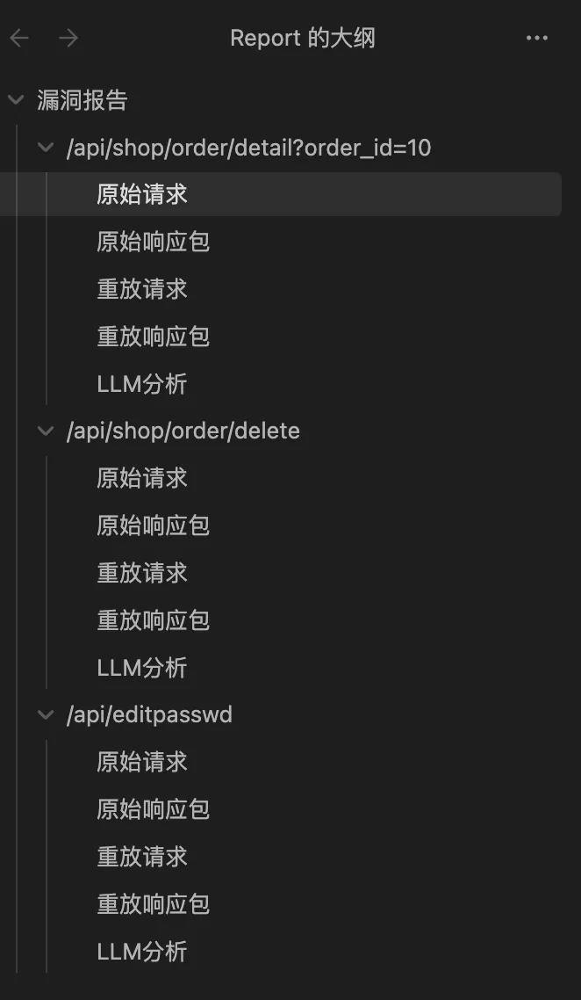

# IDOR Detecter
## 概述
在现代微服务架构转型和企业安全水准越来越高的情况下，传统的文件包含、SSRF、SQL注入等漏洞在IDE安全插件、安全开发包、代码扫描（SAST），交互式扫描（IAST）和黑盒扫描（DAST)、人工测试等方式的覆盖下已经很好地在业务上线前被检出。

更多的漏洞集中于越权（IDOR）、并发条件竞争（race condition）这类逻辑漏洞。

我们考虑到了针对越权（IDOR）漏洞自动化检测的技术并未十分成熟，因此选择了此课题，试图开发出一个针对于黑盒自动化测试来检测越权漏洞的工具。

在开发技术栈上，我们选择了Python+mitmproxy，支持https、脚本支持、跨平台、代理等功能。提供了诸多http数据包解析api，使程序开发轻量化，大大提高了开发效率。


## 漏洞检测手段
+ 数据包解析
+ 静态资源检测
+ 公共接口检测
+ Cookie替换重放检测
+ 认证信息替换检测
+ 相似度检测
+ 长度检测
+ 关键词检测
+ LLM分析检测


## LLM简述
传统的方法仅比较返回值相同或不同就得出是否有漏洞的结论，这样是存在较高误报以及存在漏洞未发现的概率的，使用AI辅助可极大提升识别准确度。

LLM模型我们选用了openai gpt-4o的api，成本低，训练数据好，实测效果好，备选有通义千问2.5、讯飞星火、claude等。后期可针对性训练小模型并优化

我们通过案例构造大量训练提示词，举大量有、无漏洞的例子并告诉ai原因，教LLM以两种假设（是否管理员账号）判断漏洞并告诉人类结果与理由。


## 报告生成
使用MarkDown格式记录漏洞接口，原始请求响应及重放请求响应，LLM分析结果


使用obsidian等markdown阅读工具可列出大纲，更清晰明显




## 团队分工
#### 流程架构设计
+ Aecous
+ unknown

#### LLM模型接入与优化
+ unknown
+ 0xA1pha
+ Aecous

#### 测试Demo设计与编写
+ ph0ebus
+ Mash1r0
+ Aecous


## 架构图


## 流程图
#### 输入流程图


#### 检测逻辑图


#### 输出流程图


#### 总流程图


## 安装及使用
配置LLM文件夹下LLM.py中的api key及LLM模型


安装python库后即可启动

```plain
python3 -m pip install -r requirements.txt
python3 start.py
```


配置浏览器代理即可


访问到可能存在漏洞的接口则会提示并开始检测


生成漏洞报告


